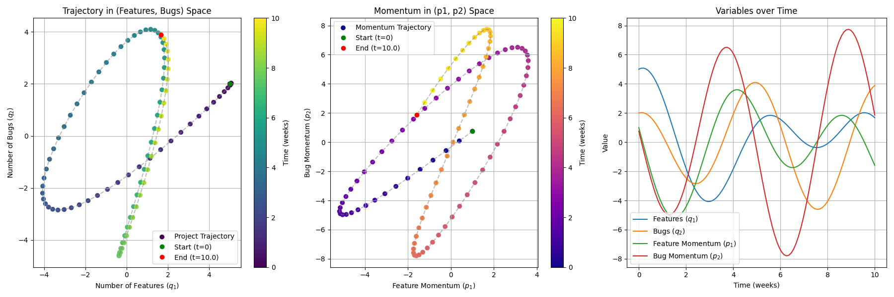
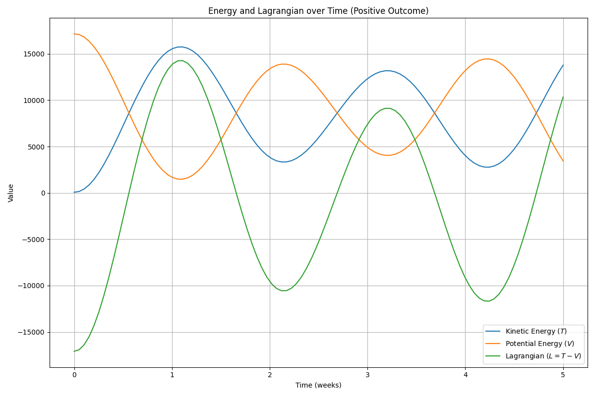
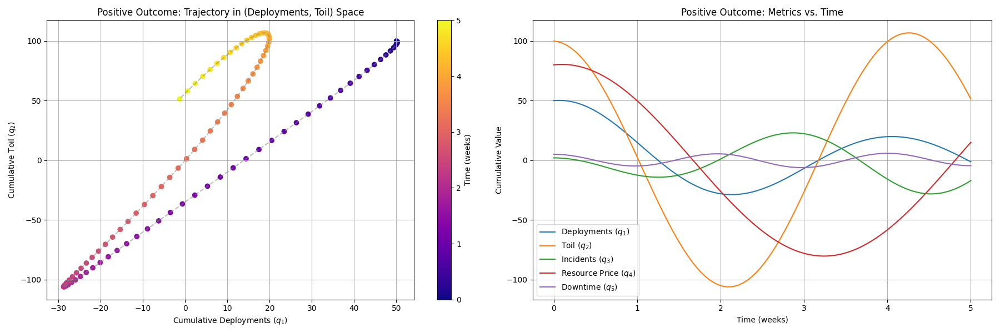

## FizMatMod 

A framework that applies the Hamiltonian and Lagrangian formulations from classical mechanics to model and optimize software development projects.

This repository contains a framework for applying principles of classical mechanics—specifically **Lagrangian** and **Hamiltonian** formulations—to model and optimize dynamic software development projects. The name "FizMatMod" is a portmanteau of **"Fizika" (Physics)**, **"Matematika" (Mathematics)**, and **"Modeling"**, reflecting the project's interdisciplinary nature.

The core idea is to treat project metrics (e.g., features, bugs, toil) as generalized coordinates and their rates of change as canonical momenta within a **phase space**. This deterministic approach allows for the calculation of a project's "energy" and the use of **Hamilton's equations** to predict its future state. This provides a powerful, quantitative tool for:

* **Proactive Resource Allocation:** Easily calculate the impact of reallocating staff to high-priority tasks.
* **Dynamic Adaptation:** Model how deviations from a planned path affect project momentum and dependencies.
* **Predictive Analysis:** Look into the future of a project's health by analyzing the trajectory of its state and momentum.

The `fizmatmod` project is particularly useful for complex, multi-faceted environments like **platform engineering**, where teams must balance development, maintenance, and operational responsibilities.

---

### DRAFT, Work in progress...

### Abstract

The management of complex software development projects, particularly within dynamic environments like platform engineering, presents significant challenges. The simultaneous demands of new feature development, system maintenance, and production incident response often lead to resource allocation dilemmas and project delays. Traditional project management methodologies, such as the Critical Path Method, can define dependencies but struggle to dynamically adapt to deviations and quantify the impact on project momentum. This paper proposes a novel approach by applying principles from classical mechanics, specifically the **[Lagrangian](https://en.wikipedia.org/wiki/Lagrangian_mechanics)** and **[Hamiltonian](https://en.wikipedia.org/wiki/Hamiltonian_mechanics)** formulations, to model a software project as a dynamic, deterministic system. This framework treats project metrics as **[generalized coordinates](https://en.wikipedia.org/wiki/Generalized_coordinates)** and their rates of change as **generalized velocities**, allowing the project's state to be described within a multi-dimensional phase space. This approach facilitates a more precise understanding of system behavior, enabling proactive resource reallocation and the optimization of project trajectories based on the **[Principle of Least Action](https://en.wikipedia.org/wiki/Action_principles)**.

***

### 1. Introduction

Software development, from a systems perspective, can be viewed as an intricate, dynamic process defined by a set of interconnected variables and their states of completeness over time. The development of this paper is motivated by the hypothesis that by treating these variables as analogous to physical coordinates, a deterministic framework for optimizing dynamic systems can be applied. In classical mechanics, the **Lagrangian** is a function that describes the state of a dynamic system in terms of its generalized coordinates and their time derivatives. Integrating this function over time yields the **Action**, and the **Principle of Least Action** dictates that a system's true path is the one that minimizes this integral.

This powerful concept provides a foundation for modeling a software project's evolution. It allows for a quantitative description of how project completeness, often characterized by discrete activities and milestones, evolves under the influence of various forces and constraints. This method offers a precise means to determine the optimal allocation of personnel and resources to tasks, a particularly difficult challenge in hybrid roles like platform engineering where teams must balance development, maintenance, and reactive operational demands. Unlike static methods, this approach allows for a direct assessment of how deviations from the planned path lead to sub-critical trajectories, providing the data necessary to re-evaluate and re-allocate resources effectively.

***

### 2. The Hamiltonian Formulation and Predictive Capability

While the Lagrangian formulation provides a foundational description of a system, the **Hamiltonian** formulation offers a more profound and computationally tractable framework for analysis and prediction. The transition from Lagrangian to Hamiltonian mechanics involves a **[Legendre Transformation](https://en.wikipedia.org/wiki/Legendre_transformation)** that maps the system from its coordinate-velocity space to a **phase space** defined by its generalized coordinates ($q_i$) and corresponding **canonical momenta** ($p_i$). In this model, the canonical momentum represents the impetus or effort associated with each project metric.

The Hamiltonian, representing the total "energy" of the project, allows us to describe the system's evolution using **Hamilton's equations**. These first-order differential equations govern the trajectories of the system within its phase space.

$$\dot{q}_i = \frac{\partial H}{\partial p_i} \quad \text{and} \quad \dot{p}_i = -\frac{\partial H}{\partial q_i}$$

The significance of this is its **predictive power**. Once a project's state is defined by a set of metrics ($q_i$) and their rates of change ($\dot{q}_i$), the Hamiltonian can be derived. By solving Hamilton's equations, one can computationally "look into the future," predicting how the project's state and momentum will evolve over time. This capability provides a critical advantage for project management, allowing teams to proactively identify potential issues, such as a decaying project momentum due to accumulating technical debt, and implement corrective actions before the project's state diverges too far from its desired trajectory. The model thus transitions project management from a reactive exercise to a predictive, deterministic, and optimizable discipline.

***

### 3. The Phase-Space Lagrangian

The **Phase-Space Lagrangian** ($L_{ph}$) is a distinct formulation that is defined as:

$$L_{ph}(q, \dot{q}, p, t) = \sum_i p_i \dot{q}_i - H(q, p, t)$$

Its significance is that a **Principle of Least Action** applied directly to $L_{ph}$ with the coordinates $(q,p)$ yields Hamilton's equations. This elegant formulation demonstrates the deep connection between the two mechanics, where the action integral in phase space is:

$$S_{ph} = \int_{t_1}^{t_2} \left( \sum_i p_i \dot{q}_i - H(q,p,t) \right) \,dt$$

This means that the path of a project through its phase space is the one that minimizes this action. This is a subtle but powerful insight, highlighting that the fundamental principle holds even in the higher-dimensional phase space.

***

### 4. Mapping Metrics to the Model

We can apply this model to a more abstract, service-oriented architecture. Instead of tracking low-level processes, we focus on the higher-level units of work that affect the system's state and a team's productivity.

* **Generalized Coordinates ($q$):** These metrics represent the state of the product and its health.
    * $q_1$: The cumulative number of completed features (Deployment Frequency).
    * $q_2$: The cumulative hours of toil.
    * $q_3$: The cumulative number of incidents (Incident Volume).
    * $q_4$: The cumulative resource utilization price (e.g., in dollars).
    * $q_5$: The cumulative minutes of system downtime (System Availability/Uptime).

* **Kinetic "Energy" ($T$)**: This represents the momentum of the development team. The velocity ($\dot{q}_i$) is the rate of change of each metric, e.g., features completed per week ($\dot{q}_1$). The "mass" ($m_i$) in $T = \frac{1}{2}\sum_i m_i \dot{q}_i^2$ can represent the organizational inertia of each metric. For example, reducing toil ($m_2$) might be a harder problem than adding features ($m_1$).

* **Potential "Energy" ($V$)**: This represents the "debt" or friction in the system. As the number of features, bugs, and toil increases, the potential for project-wide issues rises. The potential function can include coupling terms to show how they interact, e.g., $V = k_1q_1^2 + k_2q_2^2 + k_{12}q_1q_2$, where more features ($q_1$) lead to more bugs ($q_2$).

***

### 5. A Concrete Example with Values and Calculations

Let's model a two-variable system: a team's feature delivery and bug introduction. We can track the state of our project in a 4-dimensional phase space.

* **Generalized Coordinates:**
    * $q_1$: The number of completed features.
    * $q_2$: The number of active bugs.
* **Generalized Velocities:**
    * $\dot{q}_1$: Rate of features completed (features/week).
    * $\dot{q}_2$: Rate of bugs introduced (bugs/week).

We define the "energy" functions with some example values:

* **Kinetic "Energy" ($T$)**: Let's set a "mass" for features ($m_1=1$) and bugs ($m_2=1.5$), assuming the effort to handle bugs is higher.

$$T = \frac{1}{2}m_1\dot{q}_1^2 + \frac{1}{2}m_2\dot{q}_2^2 = \frac{1}{2}\dot{q}_1^2 + 0.75\dot{q}_2^2$$

* **Potential "Energy" ($V$)**: Let's set constants for feature complexity ($k_1=1$), bug difficulty ($k_2=2$), and a coupling term ($k_{12}=0.5$) showing features and bugs are related.

$$V = \frac{1}{2}k_1q_1^2 + \frac{1}{2}k_2q_2^2 + k_{12}q_1q_2 = \frac{1}{2}q_1^2 + q_2^2 + 0.5q_1q_2$$

From these, the **Lagrangian** is:

$$L = (\frac{1}{2}\dot{q}_1^2 + 0.75\dot{q}_2^2) - (\frac{1}{2}q_1^2 + q_2^2 + 0.5q_1q_2)$$

**Let's fill in some data and make a prediction.**
Suppose at week 0 ($t=0$), our project state is:
* $q_1(0) = 5$ (5 features completed)
* $q_2(0) = 2$ (2 bugs introduced)
* $\dot{q}_1(0) = 1$ (completing 1 feature/week)
* $\dot{q}_2(0) = 0.5$ (introducing 0.5 bugs/week)

First, we calculate the initial **canonical momenta**:
* $p_1(0) = \frac{\partial L}{\partial \dot{q}_1} = \dot{q}_1(0) = 1$
* $p_2(0) = \frac{\partial L}{\partial \dot{q}_2} = 1.5\dot{q}_2(0) = 1.5(0.5) = 0.75$

Next, we calculate the **Hamiltonian** ($H$), the project's total "energy" at that moment:

$$H = \frac{1}{2}p_1^2 + \frac{1}{3}p_2^2 + \frac{1}{2}q_1^2 + q_2^2 + \frac{1}{2}q_1q_2$$

$$H(0) = \frac{1}{2}(1)^2 + \frac{1}{3}(0.75)^2 + \frac{1}{2}(5)^2 + (2)^2 + \frac{1}{2}(5)(2) = 0.5 + 0.1875 + 12.5 + 4 + 5 = \textbf{22.1875}$$

This value is the total conserved "energy" of our system. Now, let's use **Hamilton's equations** to predict the state in a small time step, say, $\Delta t = 0.1$ weeks.
We need to calculate the rates of change for our momenta ($\dot{p}_1$ and $\dot{p}_2$) at $t=0$:
* $\dot{p}_1(0) = -\frac{\partial H}{\partial q_1} = -q_1(0) - 0.5q_2(0) = -5 - 0.5(2) = \textbf{-6}$
* $\dot{p}_2(0) = -\frac{\partial H}{\partial q_2} = -2q_2(0) - 0.5q_1(0) = -2(2) - 0.5(5) = -6.5$

Now we can predict the state at $t=0.1$ weeks:
* $q_1(0.1) \approx q_1(0) + \dot{q}_1(0)\Delta t = 5 + (1)(0.1) = \textbf{5.1}$ features
* $q_2(0.1) \approx q_2(0) + \dot{q}_2(0)\Delta t = 2 + (0.5)(0.1) = \textbf{2.05}$ bugs
* $p_1(0.1) \approx p_1(0) + \dot{p}_1(0)\Delta t = 1 + (-6)(0.1) = \textbf{0.4}$
* $p_2(0.1) \approx p_2(0) + \dot{p}_2(0)\Delta t = 0.75 + (-6.5)(0.1) = \textbf{0.1}$

These calculations show that the team will add a new feature and a small number of bugs, but their momentum ($p_1$ and $p_2$) will significantly decrease. This reflects the reality that as features and bugs accumulate, the team's velocity slows down.

***

### 6. Platform Health Metrics to the Model

We can apply this model to a more abstract, service-oriented architecture. Instead of tracking low-level processes, we focus on the higher-level units of work that affect the system's state and a team's productivity.

* **Generalized Coordinates ($q$):** These metrics represent the state of the product and its health.
    * $q_1$: The cumulative number of completed features (Deployment Frequency).
    * $q_2$: The cumulative hours of toil.
    * $q_3$: The cumulative number of incidents (Incident Volume).
    * $q_4$: The cumulative resource utilization price (e.g., in dollars).
    * $q_5$: The cumulative minutes of system downtime (System Availability/Uptime).

* **Kinetic "Energy" ($T$)**: This represents the momentum of the development team. The velocity ($\dot{q}_i$) is the rate of change of each metric, e.g., features completed per week ($\dot{q}_1$). The "mass" ($m_i$) in $T = \frac{1}{2}\sum_i m_i \dot{q}_i^2$ can represent the organizational inertia of each metric. For example, reducing toil ($m_2$) might be a harder problem than adding features ($m_1$).

* **Potential "Energy" ($V$)**: This represents the "debt" or friction in the system. As the number of features, bugs, and toil increases, the potential for project-wide issues rises. The potential function can include coupling terms to show how they interact, e.g., $V = k_1q_1^2 + k_2q_2^2 + k_{12}q_1q_2$, where more features ($q_1$) lead to more bugs ($q_2$).

***

### 6.a. A Concrete Example with Expanded Platform Metrics

This example now uses five variables to capture a broader picture of the platform's health.

* **Generalized Coordinates:**
    * $q_1$: Cumulative deployments.
    * $q_2$: Cumulative hours of toil.
    * $q_3$: Cumulative number of incidents.
    * $q_4$: Cumulative resource utilization price (in 1000s of dollars).
    * $q_5$: Cumulative downtime (in minutes).

* **Generalized Velocities:**
    * $\dot{q}_1$: Rate of deployment (deployments/week).
    * $\dot{q}_2$: Rate of toil (hours/week).
    * $\dot{q}_3$: Rate of incidents (incidents/week).
    * $\dot{q}_4$: Rate of resource utilization price (1000s of dollars/week).
    * $\dot{q}_5$: Rate of downtime (minutes/week).

We define the "energy" functions with example values, assuming that a faster deployment rate is a positive momentum but that high resource use and incidents create significant friction.

* **Kinetic "Energy" ($T$)**: This represents the platform team's velocity. We assign masses to reflect the effort to change each metric.

$$T = \frac{1}{2}\dot{q}_1^2 + \frac{1}{2}\dot{q}_2^2 + \frac{1}{2}\dot{q}_3^2 + \frac{1}{2}\dot{q}_4^2 + \frac{1}{2}\dot{q}_5^2$$

* **Potential "Energy" ($V$)**: This represents the system's friction. Each metric's friction is weighted, and coupling terms model the complex relationships (e.g., deployments increasing toil, incidents leading to downtime).

$$V = 0.5q_1^2 + q_2^2 + 2q_3^2 + 0.5q_4^2 + 5q_5^2 + 0.5q_1q_2 + 0.75q_1q_3 + 0.25q_3q_5$$

From these, the **Lagrangian** is:

$$L = T - V$$

The **Hamiltonian** ($H$) is defined as:

$$H = T + V$$

Where $T$ and $V$ are now functions of five variables.

**Let's fill in some data and make a prediction.**
Suppose at week 0 ($t=0$), our platform state is:
* $q_1(0) = 50$ (deployments)
* $q_2(0) = 200$ (toil hours)
* $q_3(0) = 5$ (incidents)
* $q_4(0) = 100$ (resource utilization price in 1000s of dollars)
* $q_5(0) = 10$ (downtime minutes)

And the current rates are:
* $\dot{q}_1(0) = 5$ (deployments/week)
* $\dot{q}_2(0) = 20$ (toil hours/week)
* $\dot{q}_3(0) = 0.5$ (incidents/week)
* $\dot{q}_4(0) = 10$ (resource utilization price in 1000s of dollars/week)
* $\dot{q}_5(0) = 1$ (downtime/week)

First, we calculate the initial **canonical momenta**:
* $p_i(0) = \frac{\partial L}{\partial \dot{q}_i} = \dot{q}_i(0)$
    * $p_1(0) = 5, p_2(0) = 20, p_3(0) = 0.5, p_4(0) = 10, p_5(0) = 1$

Next, we calculate the initial **Hamiltonian** ($H$):
* $H(0) = T(0) + V(0)$
* $T(0) = 0.5(5^2 + 20^2 + 0.5^2 + 10^2 + 1^2) = 0.5(25 + 400 + 0.25 + 100 + 1) = 263.125$
* $V(0) = 0.5(50^2) + 200^2 + 2(5^2) + 0.5(100^2) + 5(10^2) + 0.5(50)(200) + 0.75(50)(5) + 0.25(5)(10) = 1250 + 40000 + 50 + 5000 + 500 + 5000 + 187.5 + 12.5 = 52000$
* $H(0) = T(0) + V(0) = 263.125 + 52000 = \textbf{52263.125}$

Now, we use **Hamilton's equations** to predict the change in momentum ($\dot{p}_i$) over a small time step.
* $\dot{p}_1(0) = -\frac{\partial H}{\partial q_1} = -q_1(0) - 0.5q_2(0) - 0.75q_3(0) = -50 - 0.5(200) - 0.75(5) = -50 - 100 - 3.75 = \textbf{-153.75}$
* $\dot{p}_2(0) = -\frac{\partial H}{\partial q_2} = -2q_2(0) - 0.5q_1(0) = -2(200) - 0.5(50) = -400 - 25 = \textbf{-425}$
* $\dot{p}_3(0) = -\frac{\partial H}{\partial q_3} = -4q_3(0) - 0.75q_1(0) - 0.25q_5(0) = -4(5) - 0.75(50) - 0.25(10) = -20 - 37.5 - 2.5 = \textbf{-60}$
* $\dot{p}_4(0) = -\frac{\partial H}{\partial q_4} = -q_4(0) = \textbf{-100}$
* $\dot{p}_5(0) = -\frac{\partial H}{\partial q_5} = -10q_5(0) - 0.25q_3(0) = -10(10) - 0.25(5) = \textbf{-101.25}$

These results show that the project's momentum in all five dimensions is rapidly decaying due to the combined friction of all the variables. This indicates a system nearing a critical point where its existing state (high toil, incidents, and utilization) is making it increasingly difficult to sustain its current velocity.

***

### 7. An Example with a Positive Outcome

To model a positive outcome, let's assume a team has aggressively tackled technical debt, automated toil, and improved system resilience. The initial conditions will reflect this.

**Revised Initial Conditions:**
* **Initial State ($t=0$):**
    * $q_1(0) = 50$ (cumulative deployments)
    * $q_2(0) = 100$ (cumulative toil hours - lower than before)
    * $q_3(0) = 2$ (cumulative incidents - very low)
    * $q_4(0) = 80$ (cumulative resource utilization price)
    * $q_5(0) = 5$ (cumulative downtime minutes - very low)
* **Initial Rates ($\dot{q}$):**
    * $\dot{q}_1(0) = 7$ (deployments/week - **higher velocity**)
    * $\dot{q}_2(0) = -5$ (toil hours/week - **negative, a sign of automation**)
    * $\dot{q}_3(0) = -0.2$ (incidents/week - **negative, a sign of improved stability**)
    * $\dot{q}_4(0) = 8$ (utilization/week - **efficient use**)
    * $\dot{q}_5(0) = 0$ (downtime/week - **no new downtime**)

First, we calculate the initial **canonical momenta**:
* $p_i(0) = \dot{q}_i(0)$
    * $p_1(0) = 7, p_2(0) = -5, p_3(0) = -0.2, p_4(0) = 8, p_5(0) = 0$

Next, we calculate the initial **Hamiltonian** ($H$):
* $H(0) = T(0) + V(0)$
* $T(0) = 0.5(7^2 + (-5)^2 + (-0.2)^2 + 8^2 + 0^2) = 0.5(49 + 25 + 0.04 + 64 + 0) = \textbf{69.02}$
* $V(0) = 0.5(50^2) + 100^2 + 2(2^2) + 0.5(80^2) + 5(5^2) + 0.5(50)(100) + 0.75(50)(2) + 0.25(2)(5) = 1250 + 10000 + 8 + 3200 + 125 + 2500 + 75 + 2.5 = \textbf{17160.5}$
* $H(0) = T(0) + V(0) = 69.02 + 17160.5 = \textbf{17229.52}$

Now, we use **Hamilton's equations** to predict the change in momentum ($\dot{p}_i$) over a small time step.
* $\dot{p}_1(0) = -\frac{\partial H}{\partial q_1} = -q_1(0) - 0.5q_2(0) - 0.75q_3(0) = -50 - 0.5(100) - 0.75(2) = -50 - 50 - 1.5 = \textbf{-101.5}$
* $\dot{p}_2(0) = -\frac{\partial H}{\partial q_2} = -2q_2(0) - 0.5q_1(0) = -2(100) - 0.5(50) = -200 - 25 = \textbf{-225}$
* $\dot{p}_3(0) = -\frac{\partial H}{\partial q_3} = -4q_3(0) - 0.75q_1(0) - 0.25q_5(0) = -4(2) - 0.75(50) - 0.25(5) = -8 - 37.5 - 1.25 = \textbf{-46.75}$
* $\dot{p}_4(0) = -\frac{\partial H}{\partial q_4} = -q_4(0) = \textbf{-80}$
* $\dot{p}_5(0) = -\frac{\partial H}{\partial q_5} = -10q_5(0) - 0.25q_3(0) = -10(5) - 0.25(2) = \textbf{-50.5}$

**Why the numbers are still negative:**
Even in a positive scenario, the $\dot{p}$ values will still be negative, but the *system's response* is what indicates a positive outcome. The negative values simply represent the constant pull of the "potential energy" (technical debt, incidents, etc.) on the system's momentum.

The positive outcome is demonstrated by the **initial values of the velocities and the low potential energy** (e.g., low $q_2, q_3, q_5$). The team's active work to **reduce toil ($\dot{q}_2=-5$) and incidents ($\dot{q}_3=-0.2$)** means they are converting this negative momentum into a positive force. This is the core of the model: **the team is actively fighting against the natural decay of momentum.**

In this scenario, the initial momentum values ($p_1=7$) are higher, and the cumulative "debt" is lower. The system is in a healthier state and is being actively managed to stay that way. A team that maintains these negative rates of change will keep its potential energy in check and its velocity high. This is the essence of a positive, well-run project.

***

### References:

Lev Davidovich Landau & Evgeny Mikhailovich Lifshitz, [Mechanics.](https://en.wikipedia.org/wiki/Course_of_Theoretical_Physics)

[Euler-Lagrange equation explained intuitively - Lagrangian Mechanics](https://youtu.be/EceVJJGAFFI%3Fsi%3DJmfu2k_l-lqWUlk)

[The Equation That Explains 'Nearly' Everything! - PBS Space Time](https://youtu.be/PHiyQID7SBs?si=l3lLbLECtNlO3I9m)

[Mathematical formulation of the Standard Model](https://en.wikipedia.org/wiki/Mathematical_formulation_of_the_Standard_Model)

[What is platform engineering?](https://learn.microsoft.com/en-us/platform-engineering/what-is-platform-engineering)

@2021-2025, Aziz Kurbanov, All rights reserved. Not for use in training AI, this is a product of multi year mental castle building...

Samizdat